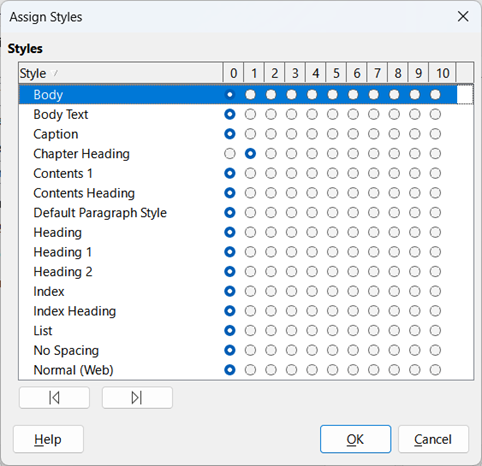

## MasterGenerate
Using Python, generate a Word document from a LibreOffice Writer Master document.

You must use the Python interpreter that accompanies LibreOffice. On Windows environment, you will find Python under _C:\Program Files\LibreOffice\program_

From https://answers.microsoft.com/en-us/msoffice/forum/all/master-documents-in-word/0d40fb6a-7f4c-4595-a210-5e7351bd03d9
From all of the forums that I've researched over the last two years or so, I've realized there tend to be two types of master documents: (1) those that are corrupt, (2) those that are about to corrupt.

Instead, I use LibreOffice to generate the master document.

### Auto Update

I set LibreOffice to automatically update all links when the document is open by doing the following steps:

1. Open the Master.odm (or any LibreOffice Writer document)
2. Tools | Options
   - LibreOffice Writer | General
     - Update Links when Loading\
        _Always_
     - LibreOffice | Security
       - Macro Security…
         - Trusted Sources tab
           - Trusted File Locations\
            _C:\Users\eddie\OneDrive\Writing_

You will need to save the master document after opening it.

## Disable Smart Quotes

1.	Open the Master.odm (or any LibreOffice Writer document)
2.	Tools | AutoCorrect | AutoCorrect Options…
   - Localized Options tab
     - Uncheck Single Quotes Replace
     - Uncheck Double Quotes Replace

## Generate Table of Contents

1. After generating the Table of Contents:
   - Right-click on Table of Contents\
    Edit\
\
   - After validating all options match the above, click Assign Styles…\
\
   - Ensure that Chapter Heading is Level 1

## Generate Master document for Microsoft Word

To generate a Word document from the Master document, perform the following steps. By the way, these steps assume that you have created a Standard.dotx template in the current folder:

1. Open LibreOffice
   - Open Master.odm
   - Save
   - Export\
     _Master.odt_\
     _ODF Text Document (*.odt)_
   - Open Master.odt
   - Save
   - Save As\
     _Master.docx_\
     _Word 2010-365 Document (*.docx)_\
     _Use Word 2010-365 Document Format_
2. Close LibreOffice
3. Open Word
   - Open Master.docx
   - Choose Developer | Document Template
   - Document Template\
     _.\Standard.dotx_\
     _Automatically update document styles (check)_

